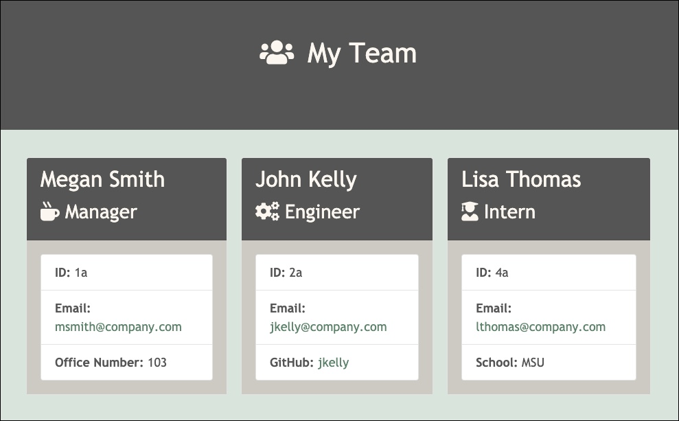

# Template Engine - Employee Summary

## Table of Contents
* [User Story](#user-story)
* [Description](#description)
* [Installation](#installation)
* [Technologies Used](#technologies-used)
* [Links and Screenshot](#links-and-screenshot)

## User Story
As a manager
I want to generate a webpage that displays my team's basic info
so that I have quick access to emails and GitHub profiles

## Description
The Software Engineering Team Node CLI will prompt the user for their email, id and other specific information based on his/her role with the company. The user can then add additional team members as well. When finished, the application will create at HTML file that displays an organized summary of the team information provided.

## Installation
* Make sure you have [node.js]Assets/my-team-screenshot.jpghttps://nodejs.org/en/download/) installed on your computer.
* Open your terminal and navigate to the appropriate directory Assets/my-team-screenshot.jpgDevelop folder).
* Run the "npm install" command.
* Run the "node app.js" command to start the application.
* Answer each of the prompts presented.

## Technologies Used
* HTML, JavaScript, CSS, Node.js
* Bootstrap: https://getbootstrap.com/
* NPM Inquirer Package: https://www.npmjs.com/package/inquirer
* Jest: https://jestjs.io/

## Links and Screenshot
* GitHub Repository Link: https://github.com/MeganCarnaghi/Template-Engine-Employee-Summary.git
* Demo Video Link: https://bit.ly/3kDeUcY

